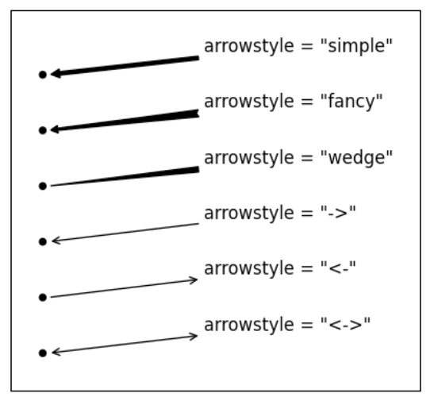

### common code

```python
	#!/bin/env python
	import matplotlib
	import matplotlib.plot as plt
	matplotlib.use('Agg') # for only save figures

	# YOUR CODE HERE

	# end
	plt.savefig(target-path)
```

About target path, there are two ways:

+ ends with '.pdf/.png/.svg'
+ plt.savefig(file-name, format='svg'), specify target format

### Draw type

+ plot
+ bar/barh
+ pie
+ scatter
+ boxplot
+ hist
+ triplot

### Line style

+ Dashed
+ Dotted
+ DashDot
+ Solid

### Marker style

+ [0, 8] predefined styles

### Make plot more self-explanatory

#### Add title

```python
	plt.title(title-string)
```

#### Add labels to each axis

```python
	plt.xlabel('X-axis')
	plt.ylable('Y-axis')
	# scaled means scale x and y equally
	plt.axis('scaled') # 'tight', similar function, plt.axes().set_aspect('equal')
```

#### Add text

```python
	plt.text(x-pos, y-pos, your-text)
	# texts are bounded by boxes.
	box = {'facecolor':'.75', 'edgecolor':'k', 'boxstyle':'round'}
	# other properties: alpha/pad
	plt.text(x-pos, y-pos, your-text, bbox = box)

	# another way, please check yourself about specified property
	plt.annotate(your-text, ha, va, xytext, xy, arrowprops)
```



#### Add legend

```python
    plt.plot(x, y, label='hah')
```

#### Set xlim and ylim

```python
    plt.xlim(xmin, xmax)
    plt.ylim(ymin, ymax)
    #plt.axes([xmin, xmax, ymin, ymax])
```
